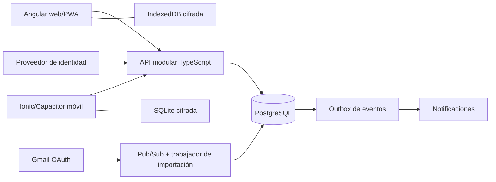

# ADR-001 · Plataforma y arquitectura

Estado: **D01 y D02 aprobadas por el propietario**. Detalles operativos sujetos a prototipo. Véase [decisiones vigentes](docs/09-aprobacion-ejecucion.md).

## Contexto y restricciones

Se necesita una web de análisis cómoda, captura móvil, operación offline, Gmail y aislamiento financiero por usuario. El proyecto es independiente. La prioridad es integridad de datos; no hay justificación inicial para microservicios. Costos, experiencia del equipo y pruebas físicas aún no están confirmados.

## Matriz de alternativas

Evaluación cualitativa de ingeniería para este producto, no resultados de benchmarks. «Más favorable» depende de las restricciones anteriores.

| Criterio | A: Angular + Flutter | B: Angular + Ionic/Capacitor | C: Flutter web + móvil |
| --- | --- | --- | --- |
| Rendimiento | Web DOM y móvil Flutter; buenas opciones de optimización por plataforma | Adecuado en principio para formularios/listas; WebView exige medir listas y gráficos | Fuerte orientación móvil; medir arranque y tablas web |
| UX móvil | Gran libertad para UI móvil especializada | Controles Ionic e integración nativa; cuidar teclado, gestos y navegación | Gran consistencia entre móviles; adaptar convenciones por SO |
| Reutilización | API compartida, TS y Dart separados | Dominio, contratos y parte de UI en TypeScript | Dominio/UI en Dart; backend puede usar otro lenguaje |
| Offline | Dos adaptadores y coordinación de contratos | Motor común; IndexedDB y SQLite diferentes | Repositorios compartidos; adaptadores locales distintos |
| Biometría | Plugin Flutter a evaluar | Plugin nativo a evaluar; no provisto por una web ordinaria | Igual que A en móvil; web requiere alternativa |
| Notificaciones | Integraciones móvil y web separadas | Capacitor móvil y Web Push separados | Integraciones web/móvil separadas |
| Mantenimiento | Mayor esfuerzo por dos clientes y dos lenguajes | Menos duplicación de reglas; vigilar compatibilidad de plugins | Menos duplicación; especial atención a escritorio y accesibilidad web |
| Seguridad | Buen potencial; depende de diseño, no del framework | Buen potencial; superficie WebView y plugins requiere hardening | Buen potencial; también requiere aislamiento backend y plugins seguros |
| Costos | Más esfuerzo inicial estimado, sin presupuesto monetario inventado | Menor esfuerzo estimado para equipo pequeño; plugins/Apple/cloud pueden costar | Esfuerzo móvil favorable; escritorio puede exigir más adaptación |
| Velocidad | Más lenta estimada por doble implementación | Más rápida estimada para formularios financieros compartidos | Rápida si el equipo domina Dart, dato aún desconocido |

## Decisión aprobada y motivos

Elegir B. Compartir reglas e idempotencia reduce divergencias entre clientes, manteniendo una presentación específica de escritorio y otra móvil. No se promete una UI totalmente nativa: Capacitor empaqueta una aplicación web con acceso a capacidades nativas. Si una prueba muestra UX, accesibilidad o cifrado inaceptables, revisar ADR y considerar A antes del core; el contrato backend y las reglas financieras seguirán documentados.

Angular ofrece soporte de service worker para PWA, pero eso no resuelve el protocolo de sincronización financiera. Flutter también requiere diseñar almacenamiento local/remoto y sus flujos. Fuentes: [Angular PWA](https://angular.dev/ecosystem/service-workers) y [Flutter offline-first](https://docs.flutter.dev/app-architecture/design-patterns/offline-first). La elección y los juicios de esfuerzo de la tabla son nuestros, no afirmaciones de esos proveedores.

## Componentes propuestos

Backend TypeScript con NestJS/Fastify, PostgreSQL y migraciones revisadas. Despliegue propuesto en Cloud Run, base administrada Cloud SQL, Secret Manager para secretos y Pub/Sub para Gmail. Trabajador y API comparten dominio, no privilegios indiscriminados. Elegir versiones soportadas y fijarlas con lockfile en el primer PR de código. El costo base de SQL administrado debe presupuestarse antes de aprovisionar; no se ha contratado infraestructura.

Autenticación administrada: Firebase Authentication con Google y email verificado; evaluar Identity Platform para MFA TOTP y comprobar costos/compatibilidad antes de fijar proveedor. No guardar contraseñas en PostgreSQL. Login Google y consentimiento Gmail son autorizaciones distintas.

## Capas y módulos

| Capa | Responsabilidad | Dependencias permitidas |
| --- | --- | --- |
| Presentation | Rutas, componentes, estados visibles, accesibilidad | Application y contratos públicos |
| Application | Registrar operación, sincronizar, importar, exportar, revocar | Domain e interfaces de repositorios |
| Domain | Dinero, asientos, presupuestos, recurrencias, fechas de negocio | Ningún framework, red o almacenamiento |
| Infrastructure | PostgreSQL, OAuth, correo, notificaciones, cifrado y almacenamiento local | Implementa puertos de Application |

Módulos: auth; transactions; accounts; cards; categories; budgets; debts; goals; subscriptions; analytics; automation; notifications; search; settings; audit. Cada módulo publica casos de uso y eventos; otro módulo no escribe directamente sus tablas. Shared contiene value objects, esquemas de contratos, tipos y protocolo de sync; nunca secretos ni acceso de administrador.

API versionada `/v1`; OpenAPI generará contratos para ambos clientes. Operaciones de escritura son comandos con idempotencia; lecturas filtradas por usuario y paginadas por cursor. Importaciones y notificaciones usan outbox transaccional. La base del servidor es autoridad confirmada; el dispositivo conserva una proyección y comandos pendientes, no otra verdad silenciosamente divergente.

## Alternativas de backend y consecuencias

Firestore facilitaría arranque y cache offline, pero la contabilidad relacionada, conciliación y consultas por periodos favorecen PostgreSQL. SQLite es una persistencia de dispositivo, no una base compartida multiusuario. No se necesita Redis al inicio: tabla outbox y Pub/Sub cubren los procesos previstos. El costo de esta decisión es implementar y probar sincronización propia y operar una base SQL.

## Acciones antes de confirmar ADR

1. Medir un prototipo con 10.000 movimientos sintéticos en web y móviles representativos.
2. Validar SQLite cifrada, Keychain/Keystore, PIN local y reconexión; revisar licencia/mantenimiento del plugin.
3. Comprobar build iOS en macOS y Android en CI sin claves en el repo.
4. Estimar gasto mensual cloud con cotización vigente y aceptar un límite.
5. Registrar aceptación o cambio de alternativa en este ADR; no marcarlo aprobado por el simple merge técnico.
