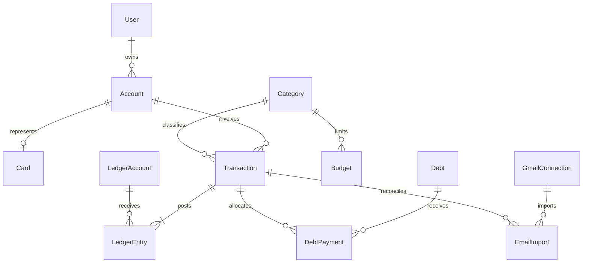

# Modelo lógico e integridad financiera

> Baseline de fase 0. Las aprobaciones y el orden de ejecución actuales están en [decisiones vigentes](09-aprobacion-ejecucion.md); prevalecen sobre estados pendientes históricos de este documento.
Estado: propuesto; no se han creado tablas definitivas. PostgreSQL es la autoridad confirmada. Los modelos del dispositivo son proyecciones versionadas de los modelos del servidor.

## Convenciones de campos, claves y seguridad

Toda entidad propiedad de usuario lleva `id UUID`, `user_id UUID`, `version BIGINT >= 1`, `created_at TIMESTAMPTZ`, `updated_at TIMESTAMPTZ`, `deleted_at TIMESTAMPTZ NULL`. PK `id`; UNIQUE `(user_id,id)`; todas las FK entre entidades privadas son compuestas `(user_id,referenced_id)` para impedir relaciones entre propietarios. `user_id` lo obtiene el backend de la identidad verificada, nunca del cuerpo enviado. Las columnas adicionales se definen abajo; `?` significa nullable.

Importes: BIGINT en unidades menores, `currency CHAR(3)` y escala de moneda validada. En JSON se envían enteros monetarios como strings para evitar pérdida de precisión JavaScript. Tasas `NUMERIC(20,10)`, jamás punto flotante para dinero. No se presupone que todas las monedas tengan dos decimales. Instantes en UTC, zona IANA en preferencias y fechas de corte/vencimiento como DATE o día de mes validado. Importes positivos; la dirección se expresa con tipo/asiento, no con signos ambiguos de una captura.

Todas las tablas privadas usan RLS con `USING` y `WITH CHECK` sobre el propietario, además de autorización en API. Rol de aplicación sin BYPASSRLS, sin propiedad de tablas y con contexto de usuario limitado a la transacción; FORCE RLS donde corresponda. Administradores y migraciones usan cuentas distintas, auditadas. Catálogo FinancialInstitution es lectura global sin datos financieros de usuarios; sólo administración puede cambiarlo.

## Entidades mínimas

| Entidad | Campos adicionales y tipos | Relaciones | Índices y unicidad |
| --- | --- | --- | --- |
| User | `auth_subject TEXT`, `display_name TEXT?`, `status ENUM(active,deleting,disabled)`, `deletion_requested_at TIMESTAMPTZ?` | Identidad externa; todos los modelos privados | UNIQUE auth_subject; User no lleva user_id, su id es propietario |
| Transaction | `kind ENUM(expense,income,transfer,payment,refund,adjustment)`, `amount_minor BIGINT`, `currency CHAR(3)`, `occurred_at TIMESTAMPTZ`, `business_date DATE`, `timezone TEXT`, `status ENUM(pending,posted,reversed)`, `account_id UUID`, `counter_account_id UUID?`, `category_id UUID?`, `merchant_id UUID?`, `original_transaction_id UUID?`, `source ENUM(manual,email,import)`, `description TEXT?`, `operation_id UUID` | Account; Category; Merchant; referencia original para reembolso | `(user_id,business_date,id)`, `(user_id,account_id,business_date)`, UNIQUE `(user_id,operation_id)` |
| Account | `name TEXT`, `type ENUM(savings,current,cash,wallet,investment,other,card_liability)`, `currency CHAR(3)`, `institution_id UUID?`, `archived BOOL`, `is_savings BOOL` | FinancialInstitution opcional; saldo deriva de asientos | `(user_id,archived,type)`; nombres no necesariamente únicos |
| Card | `account_id UUID`, `label TEXT`, `last4 CHAR(4)?`, `limit_minor BIGINT`, `currency CHAR(3)`, `cutoff_day SMALLINT?`, `payment_day SMALLINT?`, `next_due_date DATE?`, `statement_due_minor BIGINT?`, `minimum_due_minor BIGINT?`, `statement_as_of DATE?` | Account de tipo card_liability misma moneda; vencimiento confirmado separado de patrón | UNIQUE `(user_id,account_id)`; `(user_id,next_due_date)`; no PAN/CVV/PIN |
| Category | `name TEXT`, `kind ENUM(expense,income)`, `parent_id UUID?`, `icon_key TEXT`, `color_token TEXT`, `archived BOOL` | Category padre del mismo usuario, sin ciclos | `(user_id,kind,archived)` |
| Budget | `category_id UUID`, `month DATE`, `limit_minor BIGINT`, `currency CHAR(3)`, `thresholds JSONB` | Category; mes normalizado al día 1 | UNIQUE `(user_id,category_id,month,currency)` |
| Debt | `account_id UUID`, `counterparty_alias TEXT`, `direction ENUM(payable,receivable)`, `principal_minor BIGINT`, `currency CHAR(3)`, `rate NUMERIC(20,10)?`, `rate_period ENUM(month,year)?`, `interest_method ENUM(simple,compound,none)?`, `start_date DATE?`, `due_date DATE?`, `terms_confirmed BOOL`, `status ENUM(open,closed,disputed)` | Account pasivo o cuenta por cobrar; no inferir tasa o capitalización | `(user_id,direction,status,due_date)` |
| DebtPayment | `debt_id UUID`, `transaction_id UUID`, `principal_minor BIGINT`, `interest_minor BIGINT`, `fees_minor BIGINT`, `paid_on DATE` | Debt y Transaction misma moneda; suma de componentes = pago | UNIQUE `(user_id,transaction_id,debt_id)`; `(user_id,debt_id,paid_on)` |
| SavingsGoal | `name TEXT`, `target_minor BIGINT`, `currency CHAR(3)`, `target_date DATE?`, `frequency ENUM(weekly,fortnightly,monthly)`, `status ENUM(active,paused,completed)` | GoalContribution registra aportes/retiros reales | `(user_id,status,target_date)` |
| Subscription | `merchant_id UUID?`, `name TEXT`, `amount_minor BIGINT`, `currency CHAR(3)`, `interval_unit ENUM(day,week,month,year)`, `interval_count SMALLINT`, `next_charge_date DATE?`, `status ENUM(suggested,active,paused,cancelled)`, `confirmed_at TIMESTAMPTZ?` | Merchant; SubscriptionOccurrence enlaza operaciones | `(user_id,status,next_charge_date)` |
| Merchant | `display_name TEXT`, `normalized_key TEXT`, `default_category_id UUID?` | Category por usuario | UNIQUE `(user_id,normalized_key)` |
| FinancialInstitution | `id UUID`, `code TEXT`, `name TEXT`, `country_code CHAR(2)`, `active BOOL`, `version BIGINT`, `created_at/updated_at TIMESTAMPTZ` | Catálogo público de instituciones; sin user_id ni datos bancarios privados | UNIQUE code |
| AutomationRule | `name TEXT`, `enabled BOOL`, `priority INT`, `conditions JSONB`, `action ENUM(suggest_category,suggest_subscription,notify)`, `action_config JSONB`, `schema_version INT` | Referencias a categoría/cuenta validadas; sin ejecución de código libre | `(user_id,enabled,priority)` |
| EmailImport | `connection_id UUID`, `provider_message_id TEXT`, `parser_code TEXT`, `parser_version TEXT`, `fingerprint TEXT?`, `status ENUM(queued,parsed,review,linked,rejected,error)`, `confidence NUMERIC(4,3)?`, `reason_codes TEXT[]`, `candidate JSONB?`, `transaction_id UUID?`, `processed_at TIMESTAMPTZ?` | GmailConnection; Transaction privada | UNIQUE `(user_id,connection_id,provider_message_id)`; `(user_id,status,created_at)` |
| Notification | `kind TEXT`, `entity_type TEXT`, `entity_id UUID?`, `channel ENUM(in_app,push)`, `schedule_key TEXT`, `due_at TIMESTAMPTZ?`, `sent_at TIMESTAMPTZ?`, `read_at TIMESTAMPTZ?`, `status ENUM(pending,sent,failed,cancelled)` | Referencia de entidad validada por caso de uso y propietario | UNIQUE `(user_id,channel,schedule_key)`; `(status,due_at)` para trabajador acotado |
| UserPreference | `timezone TEXT`, `locale TEXT`, `base_currency CHAR(3)`, `theme ENUM(light,dark,system)`, `quiet_hours JSONB?`, `show_notification_amounts BOOL DEFAULT false` | Una fila por User | UNIQUE user_id |
| AuditLog | `actor_type ENUM(user,worker,admin)`, `actor_id TEXT`, `action TEXT`, `entity_type TEXT`, `entity_id UUID?`, `request_id UUID`, `changed_fields TEXT[]`, `outcome ENUM(success,denied,error)` | Evento inmutable con propietario; sin cuerpos/tokens/importe completo | `(user_id,created_at,id)`, `(request_id)`; no update/delete de aplicación |

Los estados ENUM son valores de contrato; decidir enum SQL o CHECK al migrar. JSONB admite únicamente esquemas cerrados versionados y límites de tamaño; no permite omitir claves foráneas ni autorización.

## Modelos de soporte necesarios

| Modelo | Campos, relaciones e invariantes |
| --- | --- |
| LedgerAccount | Campos comunes; `type ENUM(asset,liability,income,expense,equity)`, `currency`, `account_id UUID?`, `system_key TEXT?`; FK privada a Account, UNIQUE `(user_id,system_key,currency)` si no nulo |
| LedgerEntry | Campos comunes; `transaction_id UUID`, `ledger_account_id UUID`, `debit_minor BIGINT`, `credit_minor BIGINT`, `currency`; sólo un lado > 0; FK privadas; índice `(user_id,ledger_account_id,created_at)`; append-only |
| GmailConnection | Campos comunes; `provider_subject TEXT`, `email_masked TEXT`, `token_secret_ref TEXT`, `scopes TEXT[]`, `consented_at`, `revoked_at?`, `watch_expires_at?` TIMESTAMPTZ, `history_cursor TEXT?`; UNIQUE `(user_id,provider_subject)` |
| DeviceSession | Campos comunes; `device_id UUID`, `token_hash TEXT`, `last_seen_at`, `expires_at`, `revoked_at?` TIMESTAMPTZ; índice `(user_id,revoked_at)`; tokens claros fuera de DB |
| SyncOperation | Campos comunes; `operation_id UUID`, `device_id UUID`, `payload_hash TEXT`, `base_version BIGINT`, `result JSONB`, `completed_at TIMESTAMPTZ`; UNIQUE `(user_id,operation_id)` |
| ChangeEvent | Campos comunes; `sequence BIGINT`, `entity_type TEXT`, `entity_id UUID`, `entity_version BIGINT`, `deleted BOOL`; UNIQUE `(user_id,sequence)` para pull ordenado |
| OutboxEvent | Campos comunes; `event_key TEXT`, `kind TEXT`, `payload JSONB` mínimo, `attempts INT`, `available_at TIMESTAMPTZ`, `processed_at TIMESTAMPTZ?`; UNIQUE `(user_id,event_key)`, índice de pendientes |
| GoalContribution | Campos comunes; `goal_id UUID`, `transaction_id UUID`, `direction ENUM(in,out)`, `amount_minor BIGINT`; FK privadas; UNIQUE `(user_id,goal_id,transaction_id)`; suma de asignaciones no supera importe elegible |
| SubscriptionOccurrence | Campos comunes; `subscription_id UUID`, `transaction_id UUID`; FK privadas; UNIQUE `(user_id,transaction_id)` |
| DebtInstallment | Campos comunes; `debt_id UUID`, `number INT`, `due_date DATE`, `principal_minor/interest_minor/fees_minor BIGINT`, `schedule_version INT`, `status ENUM(planned,paid,overdue,cancelled)`; UNIQUE `(user_id,debt_id,schedule_version,number)` |
| FxQuote | Campos comunes; `from_currency/to_currency CHAR(3)`, `rate NUMERIC(20,10)`, `as_of TIMESTAMPTZ`, `source TEXT`; tipo de cambio informativo, no cambia asiento original |

## Relaciones principales

## Reglas contables verificables

Cada operación confirmada tiene asientos balanceados: débitos = créditos por moneda dentro de una transacción SQL. Registrar gasto S/ 100 con tarjeta debita gasto y acredita pasivo por 10.000 céntimos; pagarlo debita pasivo y acredita efectivo por 10.000. El gasto del mes sigue siendo S/ 100, no S/ 200. Transferir entre cuentas propias no aumenta ingreso ni gasto.

Saldo inicial es ajuste contra patrimonio, no salario. Reembolso enlaza el original y reduce gasto; uno parcial no puede superar el saldo reembolsable salvo ajuste explícito revisado. Nunca borrar silenciosamente asientos: corregir mediante reversión y sustitución auditadas. Categoría y nota pueden editarse con versionado sin alterar dinero; cambiar importe/moneda/cuentas de un asiento confirmado requiere reversión. Las compras pendientes afectan exposición estimada, no el saldo confirmado; confirmar una compra la reconcilia, no la duplica.

Cuotas redistribuyen vencimientos del pasivo; no vuelven a registrar la compra completa como gasto cada mes. Intereses y comisiones sí son gasto separado. Los pagos mínimos, del periodo y deuda total son datos distintos; disponible informado puede diferir de línea menos pasivo por retenciones. Guardar fecha y procedencia del dato bancario.

No sumar PEN y USD directamente. Una transferencia multimoneda tiene piernas balanceadas por moneda mediante cuentas de compensación y tipo de cambio explícito, incluido redondeo. Si falta tasa, mostrar totales separados; el MVP puede limitar la captura a transferencias de igual moneda y presentar esta limitación antes de guardar.

## Duplicados, versiones y eliminación

Reintento exacto de `operation_id` devuelve resultado anterior. Mismo ID con payload distinto produce 409, no otra operación. Mensaje Gmail se identifica por conexión y message ID. Huella de entidad/referencia/importe/moneda/fecha ayuda a conciliar avisos distintos del mismo consumo, pero no es UNIQUE: dos compras legítimas iguales no se eliminan automáticamente. Una importación enlazada a registro manual conserva una sola Transaction y varias evidencias.

Control optimista `base_version`; migraciones numeradas, expandir antes de contraer y compatibility window de dos versiones de cliente. Cursor servidor avanza sólo tras commit; restauraciones incluyen generación de cursor para forzar resync cuando sea necesario. Tombstones propuestos 90 días; un cliente más antiguo hace resync completo conservando sus operaciones pendientes para revisión. La eliminación de cuenta purga datos privados y desactiva conectores; política de backups y auditoría en [SECURITY.md](../SECURITY.md).
