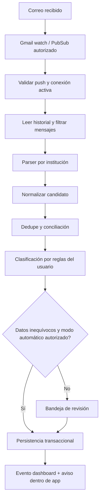

# Arquitectura Gmail y automatizaciones

> Baseline de fase 0. Las aprobaciones y el orden de ejecución actuales están en [decisiones vigentes](09-aprobacion-ejecucion.md); prevalecen sobre estados pendientes históricos de este documento.
Estado: diseño propuesto. No hay OAuth activo, correos leídos ni parsers verificados con mensajes reales.

## Consentimiento y mínimos permisos

El login Google no autoriza leer correo. La pantalla «Conectar Gmail» explica cuenta, propósito, rango inicial y revocación; inicia OAuth por backend, navegador del sistema, state de un solo uso y PKCE donde el flujo lo permita. El callback valida sesión, estado, URI exacta y sujeto de la cuenta. El refresh token se guarda cifrado sólo en backend. No pedir contraseñas ni usar cookies del navegador del usuario como mecanismo de importación.

Proponer `gmail.readonly`, que permite leer más que los mensajes filtrados por la aplicación. El filtro no reduce por sí mismo el alcance OAuth. Es un scope restringido; verificación de Google y posible evaluación de seguridad dependen del uso y tratamiento de datos. Debe resolverse antes de beta externa, sin asumir que uso personal permite cualquier despliegue. Fuente: [scopes Gmail](https://developers.google.com/workspace/gmail/api/auth/scopes).

## Flujo

Backend registra watch, renueva diariamente y vigila expiración: Gmail requiere renovación al menos cada siete días. Pub/Sub comunica cambios de historial; no entrega directamente el consumo financiero. Trabajador lee cambios desde cursor guardado, persiste resultados y sólo entonces avanza cursor/ack. Fuente: [Gmail push](https://developers.google.com/workspace/gmail/api/guides/push).

Con cursor inválido o demasiado antiguo, Gmail puede devolver 404. Recuperar con sincronización completa del rango autorizado y dedupe, nunca inventar continuidad. Fuente: [Gmail sync](https://developers.google.com/workspace/gmail/api/guides/sync). Propuesta de rango inicial: últimos 30 días con selector del usuario; fuera de rango requiere nueva selección explícita. Indicar periodos no cubiertos y última sincronización exitosa.

## Adaptadores

Contrato propuesto: `parse(headers, sanitizedText, receivedAt) -> candidates[], reasonCodes[], parserVersion`. Candidato: referencia bancaria opcional, banco, tipo, importe en unidades menores, moneda, fecha/precisión, comercio, últimos cuatro dígitos opcionales, estado pendiente/confirmado y evidencia mínima de campos. Nada de HTML ejecutable, enlaces visitados o adjuntos abiertos automáticamente.

BCP será la única entidad soportada en MVP, sujeto a muestras autorizadas anonimizadas. Registros de adaptadores futuros: BBVA, Interbank, Scotiabank, Oh!, Yape y Plin. Un nombre de remitente no prueba autenticidad: combinar dominio validado, señales de autenticación disponibles y estructura esperada, enviando casos dudosos a revisión. Parser genérico únicamente propone campos; no registra automáticamente un gasto incierto. No afirmar soporte de un banco sin fixtures, pruebas y versión de formato.

## Idempotencia y conciliación

Clave exacta conexión + message ID; duplicados Pub/Sub/reintentos no crean otra importación. Una huella con banco, referencia, moneda e importe busca avisos relacionados. Sin referencia fiable, similitud de comercio/importe/fecha sólo sugiere coincidencia. Múltiples compras iguales deben conservarse. Aviso de compra pendiente y confirmación comparten Transaction después de conciliación. Pago de tarjeta no es gasto, reverso no es ingreso ordinario y abono de tercero puede requerir tipo manual.

La persistencia de importación, operación, asientos, auditoría y evento es atómica. Un mensaje rechazado conserva marcador mínimo para no reaparecer continuamente; el usuario puede solicitar reprocesado al cambiar parser. Cambio de versión del parser no modifica asientos aceptados silenciosamente.

## Fallos y operación

| Fallo | Comportamiento |
| --- | --- |
| Consentimiento denegado | Aplicación manual sigue disponible |
| Token revocado/invalid_grant | Desactivar conexión, cancelar jobs, mostrar reconectar; no bucle |
| 429/5xx | Backoff exponencial con jitter y límite; cola de fallos revisable |
| Push duplicado/fuera de orden | Leer desde cursor duradero; procesamiento serial por conexión |
| Parser desconocido | Revisión con motivo y campos faltantes; no importe cero inventado |
| Watch vencido | Renovar, recuperar intervalo perdido y mostrar cobertura |
| Borrado de usuario | Job comprueba estado otra vez antes de persistir |

Métricas sin contenido: retraso desde recepción, candidatos/revisiones, tasa de error por versión, renovaciones vencidas y duplicados descartados. Revisión por campo muestra procedencia y permite corregir antes de aceptar. No almacenar cuerpo completo por defecto; depuración con mensajes anonimizados autorizados fuera de producción.

## Suscripciones, notificaciones e IA

V2 agrupa comercio/cuenta/moneda y observa al menos tres cargos compatibles antes de sugerir periodicidad, contemplando variaciones de importe. El usuario confirma y puede descartar. Próximo cobro y costo anual son estimaciones etiquetadas, no facturas confirmadas. Reglas no ejecutan código libre.

Avisos persistentes en app son fuente consultable. Push requiere permiso separado y dispositivo registrado; importe oculto por defecto, zona horaria y horas silenciosas. Clave de envío incluye usuario, evento, versión de programación y canal; cambiar vencimiento cancela el anterior. Reintentos no garantizan entrega al teléfono: se conserva estado en app. No se envían emails de cobranza ni mensajes a terceros automáticamente.

V3 usa consultas tipadas sobre agregados del usuario autenticado, periodo y moneda; el modelo no elige tenant ni ejecuta SQL arbitrario. Respuesta incluye periodo, cifras usadas y límites de cobertura. No enviar cuerpos Gmail al modelo. Texto de correo/comercio se trata como dato, nunca instrucción. El asistente no autoriza pagos ni modifica deuda por conversación sin un caso de uso explícito revisable.
