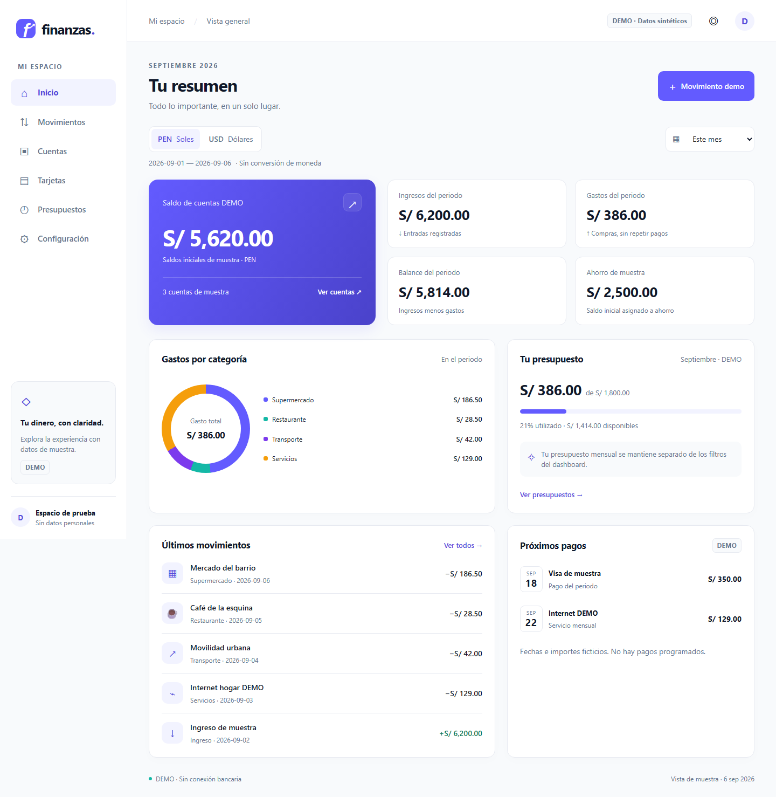
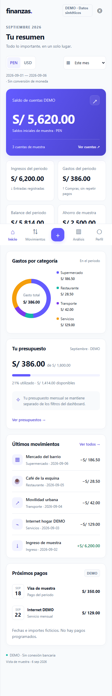
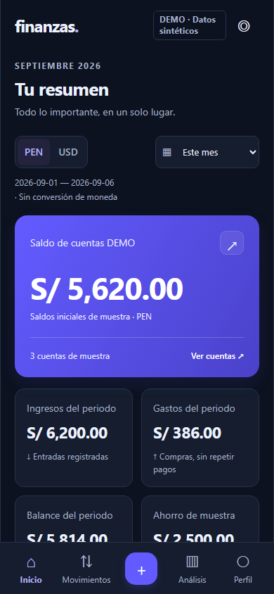

# P02 · Experiencia DEMO Web, Mobile y PWA

Rutas reales: Inicio, Movimientos, Cuentas, Tarjetas, Presupuestos, Configuración; móvil añade acceso central a formulario DEMO y Análisis. Navegación desktop lateral y móvil inferior, scroll propio comprobado. No es una aplicación financiera real todavía.

Preview propuesto en [Web](https://srendergyt.github.io/finanzas-personales/) y [Mobile](https://srendergyt.github.io/finanzas-personales/mobile/); sólo considerarlo publicado cuando la ejecución Preview DEMO finalice correctamente. La URL muestra el último commit publicado y su `build-info.json`, no un entorno de datos reales. PRs externos ejecutan pruebas pero no despliegan.

## Funciones y aceptación

- Dashboard con fixtures sintéticas identificadas, saldos iniciales ilustrativos, ingresos/gastos/balance del periodo, ahorro inicial, presupuesto mensual, próximos pagos y actividad. Saldos iniciales no se presentan como saldo bancario conciliado.
- Selector PEN/USD, todos los rangos solicitados y fechas personalizadas validadas. Nunca totalizar monedas distintas. Filtros y búsqueda funcionan sobre la muestra.
- Formulario DEMO valida importe mediante enteros BigInt y actualiza la sesión. No persiste operaciones ni reemplaza el core o ledger de P06. Recargar reinicia muestra.
- Claro/oscuro/sistema, ocultación de importes y preferencias locales; no se guarda ningún dato financiero real.
- Componentes reutilizables en packages/ui: Button, Input, MoneyInput, Select, Card, FinancialCard, TransactionRow, AccountCard, CreditCard, Badge, Modal/BottomSheet, Alert, Toast, Skeleton, EmptyState, DatePicker, SearchInput, CategoryPicker, SyncStatus, ChartCard. Modal y sheet comparten dialog nativo con foco/escape; layout se adapta.
- Manifest, iconos maskable/apple-touch, colores de lanzamiento y service worker de shell. PWA recarga offline en test Chromium. Instalación física Chrome Android/Safari iPhone sigue pendiente de prueba del usuario; no se afirma TestFlight.

## Evidencia

Tests: filtros por moneda/fecha, pago no repetido como gasto en agregador DEMO, importe decimal exacto, formulario, navegación móvil, scroll hasta últimos pagos, ausencia de overflow, chequeos automatizados WCAG AA en claro/oscuro y recarga offline del shell. Axe no sustituye revisión completa manual con lector de pantalla.

`npm run build`, `npm run typecheck`, `npm run lint`, `npm test`, `npm run test:integration`, `npm run test:e2e` y `npm run security`. Screenshots se regeneran mediante Playwright; CI los entrega como artifact por commit. Backend sólo tiene health; ningún conector activo.

Riesgos/deuda técnica: demo de sesión no es registro durable; tarjetas y saldos son muestras; accesibilidad nativa/dispositivos físicos pendientes. P03 entrega prototipo durable cifrado separado y evidencia; detenerse después antes del core.
