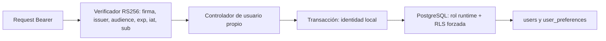

# P04 — API y aislamiento por usuario

P04 agrega una API NestJS/Fastify ejecutable y un módulo de preferencias persistente. El dashboard público sigue usando DEMO; esta API no está conectada a los datos del propietario ni desplegada públicamente. La continuación después de P03 fue autorizada en [el registro de decisiones](09-aprobacion-ejecucion.md).

## Contrato

| Ruta                     | Acceso          | Resultado                                                    |
| ------------------------ | --------------- | ------------------------------------------------------------ |
| GET /health              | Público         | Liveness del proceso, no prueba disponibilidad de PostgreSQL |
| GET /v1                  | Público         | Versión y fase del contrato                                  |
| GET /openapi.json        | Público         | Especificación generada desde los controladores              |
| GET /v1/me               | Bearer validado | ID, tema y locale propios                                    |
| PATCH /v1/me/preferences | Bearer validado | Persiste un tema light, dark o system                        |

PATCH admite exactamente un campo `theme` de tipo string; campos extra, arreglos y valores inválidos se rechazan. No existe selector de usuario ni endpoint de listado de usuarios. `x-user-id`, parámetros de consulta y payloads nunca determinan la identidad. Los errores devuelven un código genérico y un requestId generado por el servidor; no incluyen SQL, payloads, rutas con parámetros, credenciales ni stacks. Los logs sólo contienen requestId, método y estado HTTP. El body se limita a 16 KiB y las respuestas no se cachean.

## Frontera de confianza

P04 verifica JWT asimétricos con claves **públicas** configuradas, emisor y audiencia exactos, algoritmo RS256 y antigüedad máxima de cinco minutos. Sin configuración no hay acceso autenticado: los tests de health usan un verificador que deniega todo. El proceso real exige configuración y no inicia si el rol DB es propietario, superusuario, BYPASSRLS o puede crear estructuras. P05 implementará emisión, login Google/email, verificación email, recuperación, sesiones y revocación; este verificador por sí solo **no es autenticación de producto terminada**. No se entregan tokens firmados estáticos ni una puerta de acceso DEMO.

## PostgreSQL y migraciones

Versión fijada: PostgreSQL **17.11**, imagen `postgres:17.11-bookworm`. La versión procede de las [notas oficiales](https://www.postgresql.org/docs/release/). Migraciones SQL numeradas en `backend/api/migrations`; `npm run db:migrate` usa exclusivamente `MIGRATION_DATABASE_URL`, privilegio separado del proceso API. El ejecutor usa advisory lock, transacciones y checksums SHA-256; rechaza historia desconocida, cambios retroactivos y orden incorrecto. No modificar una migración aplicada: agregar la siguiente. No hay rollback destructivo automático; recuperar mediante backup probado o una migración correctiva.

`app.users` guarda UUID y fecha; `app.user_preferences` tiene PK/FK `user_id`, tema y locale. No almacena email, importes ni datos personales de las fotos. Las FK de futuras entidades financieras deberán ser compuestas por `(user_id, entity_id)` para impedir referencias entre propietarios; esas entidades todavía no existen en P04.

Ambas tablas usan ENABLE y FORCE ROW LEVEL SECURITY, siguiendo la [documentación de PostgreSQL](https://www.postgresql.org/docs/17/ddl-rowsecurity.html). El rol `finanzas_runtime` es NOLOGIN, sin administración ni BYPASSRLS. Sólo puede leer users y leer/insertar preferencias; UPDATE se limita a las columnas de preferencia, nunca `user_id`. No tiene DELETE, TRUNCATE ni DDL. Aprovisionar el login de servicio separadamente y otorgarle ese rol; su contraseña debe venir del gestor de secretos, nunca de Git.

Cada operación reserva una conexión, abre transacción y usa `set_config('app.user_id', idValidado, true)`. El contexto desaparece tras COMMIT/ROLLBACK. Una conexión sin contexto no ve filas. Si falla el rollback se descarta la conexión. RLS es defensa frente a errores de consulta; no sustituye el verificador, la protección de credenciales ni previene un servidor completamente comprometido de cambiar su propio contexto.

## Ejecutar y verificar

1. `npm ci` y `npm run build:backend`.
2. Para desarrollo aislado y pruebas: iniciar Docker y ejecutar `npm run test:postgres`. Crea un contenedor exclusivo con contraseñas aleatorias en memoria, aplica las migraciones dos veces, crea un login restringido, prueba usuarios sintéticos y elimina sólo ese contenedor. No utiliza DATABASE_URL existente. No omite silenciosamente pruebas si Docker falla.
3. Para una base del entorno: configurar MIGRATION_DATABASE_URL de forma segura y ejecutar `npm run db:migrate`. Aprovisionar el login restringido como infraestructura. No usar el login migrador en la API.
4. Configurar DATABASE_URL, AUTH_PUBLIC_JWKS (JWKS público JSON), AUTH_ISSUER y AUTH_AUDIENCE; ejecutar `npm run start:api`. Escucha 127.0.0.1:3000 por defecto. HOST/PORT permiten configurar el contenedor. TLS externo, Secret Manager y staging se preparan antes de publicar la API; este PR no publica un servidor sin autenticación de producto.

CI ejecuta `npm run test:postgres` como parte del check obligatorio «Lint, tests y builds». Las pruebas usan PostgreSQL real y el rol restringido, no mocks de RLS. Cubren migración repetida, rol privilegiado rechazado, permisos DDL/TRUNCATE, ausencia de identidad, A intentando leer/modificar B, FK, rollback, veinte operaciones concurrentes reutilizando una conexión, JWT inválido/expirado/emisor o audiencia incorrectos, usuario desconocido, manipulación de user_id, actualización propia y ausencia de datos sensibles en logs.

La integración HTTP adicional verifica health, versión, OpenAPI y acceso denegado sin credenciales. Lint, typecheck, build y pruebas existentes siguen ejecutándose. El resultado concreto y enlace a la ejecución se adjuntan en el PR, sin confundir código de pruebas con evidencia de ejecución.

## Límites y próximo paso

No hay cuentas financieras, ledger, búsqueda, exportación ni sincronización; sus pruebas A/B se agregan cuando existan los módulos. No hay login interactivo, revocación, rate limiting de producto ni integración UI/API: corresponde a P05. No hay cambios visuales en P04; las [capturas de P02](P02-preview.md) y el [preview DEMO](https://srendergyt.github.io/finanzas-personales/) siguen disponibles. La validación física nativa de P03 sigue pendiente y no se declara resuelta por estos tests.
